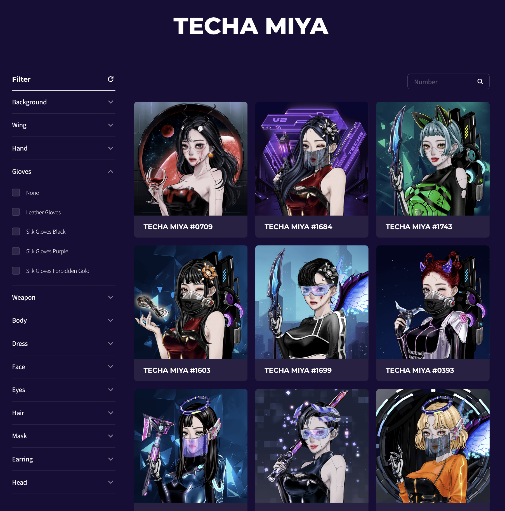

# 핑거랩스 프론트엔드 채용 사전 과제




<br />

## 개요
Techa Miya NFT(Non-Fungible Token)는 핑거랩스의 대표 프로젝트 선미야클럽의 NFT 중 하나로<br/>
Klaytn 체인 안에서 실제 운영 중인 NFT 입니다.<br/>

**Techa Miya NFT 이미지를 볼 수 있는 갤러리 형태의 페이지를 구현하는 것**이 사전 과제의 목표입니다.

[선미야클럽 테카 미야 갤러리 링크 (Sunmiya Club Techa Miya Gallery)](https://sunmiya.club/gallery/techa)

<br />
<br />

## 과제 수행에 필요한 사전 정보
Techa Miya NFT는 2023년 3월 기준으로 토큰(Token) 번호 0번 부터 약 2000번 까지 발행되어 있습니다.<br/>
토큰 번호 0번의 NFT 이미지를 불러오기 위해서는 Klaytn 체인에 Techa Miya NFT의 0번 토큰에 대한 정보를 요청해야 합니다.<br/>
이를 위해선 ABI(Application Binary Interface)와 스마트 컨트랙트 주소(Smart Contract Address)를 필요로 합니다.

<br/>

스마트 컨트랙트 주소와 ABI는 다음과 같습니다.
```javascript
  const techaMiyaContractAddress = '0x5ffc2d8d30c3182b3e8a37d2372dd337b447a6bc';
  const techaMiyaABI = [{
    "inputs": [
      {
        "internalType": "uint256",
        "name": "tokenId",
        "type": "uint256"
      }
    ],
    "name": "tokenURI",
    "outputs": [
      {
        "internalType": "string",
        "name": "",
        "type": "string"
      }
    ],
    "stateMutability": "view",
    "type": "function"
  }];
```
<br/>

Tehca Miya NFT 컨트랙트 인스턴스를 통해 tokenURI 함수를 호출하면 NFT 메타데이터 URI를 반환합니다. <br/>
이를 이용하여 Techa Miya NFT의 특정 번호 토큰에 대한 정보를 불러올 수 있습니다. <br/>

```javascript
  const techaMiya = new ethers.Contract(techaMiyaContractAddress, techaMiyaABI, provider);
  await techaMiya.tokenURI(0); // https://planet-miya.sunmiya.club/techa/0.json
```

<br/>

https://planet-miya.sunmiya.club/techa/0.json 에 접속하면 NFT 메타데이터가 JSON 형식으로 반환됩니다.
```json
{
  "name": "Techa Miya #0000",
  "image": "https://planet-miya.sunmiya.club/techa/0.png",
  "description": "[Universe #1 The City of Machines - Techa] MIYA entered the door shining in purple and arrived at Techa - the city of icy machines. At Techa, where everything only works with system and efficiency, emotion, inefficiency, abundance, or no such thing is accepted. Techa - scientifically developed and extremely civilized city. MIYA hurried to disguise herself among the people of Techa. But she could not hide her unique delightness.",
  "attributes": [
    {
      "trait_type": "Background",
      "value": "Gradient Sky"
    },
    {
      "trait_type": "Wing",
      "value": "None"
    },
    {
      "trait_type": "Hand",
      "value": "Supporting Hand Artificial"
    },
    {
      "trait_type": "Gloves",
      "value": "None"
    },
    {
      "trait_type": "Weapon",
      "value": "Moebius Blade Black"
    },
    {
      "trait_type": "Body",
      "value": "Machine Body"
    },
    {
      "trait_type": "Dress",
      "value": "Crop Top Pink"
    },
    {
      "trait_type": "Face",
      "value": "Basic Face2"
    },
    {
      "trait_type": "Eyes",
      "value": "Basic Eye3"
    },
    {
      "trait_type": "Hair",
      "value": "Long Straight Brown"
    },
    {
      "trait_type": "Mask",
      "value": "None"
    },
    {
      "trait_type": "Earring",
      "value": "None"
    },
    {
      "trait_type": "Head",
      "value": "Hologram Visor Pink"
    }
  ]
}
```

위 내용와 관련한 샘플 코드가 있습니다. [sample.html](./sample.html)을 참고하여 진행해주세요. 

<br />
<br />

## 과제 목표
- Techa Miya의 NFT 이미지를 볼 수 있는 갤러리 형태의 페이지
  - 0번에서 **999번**까지, 총 1000개의 NFT 정보를 이용하여 구현해주세요.
  - 상단의 [스크린샷](./techa_gallery.png)이 우리가 구현 할 목표입니다.
- NFT의 속성(attributes)으로 필터링하는 기능
  - NFT의 속성은 대분류인 trait_type과 소분류의 value로 이루어져 있습니다.
  - attributes 데이터를 이용하여 [선미야클럽의 갤러리 페이지](https://sunmiya.club/gallery/techa)처럼 필터링이 되도록 구현해주세요.
- 토큰 번호로 검색하는 기능
  - Techa Miya NFT의 토큰 정보에는 name 데이터가 있습니다.
  - name 데이터에 있는 토큰 번호를 이용하여 검색 기능을 구현해주세요.
- 최적화
  - 원하는 방법으로 페이지를 최적화해주세요.
- 디자인
  - 피그마나 제플린 링크는 제공되지 않습니다. 대신, [스크린샷](./techa_gallery.png)과 [선미야클럽의 갤러리 페이지](https://sunmiya.club/gallery/techa)를 참고하여 디자인을 해주세요.
  - 중요한 것은 디자인의 가시성입니다. 알아볼 수 있는 형태를 갖추는 것이 중요하며, 디자인의 세부 요소는 중요하지 않습니다.
- Etc.
  - 실제 선미야클럽 갤러리 페이지의 'MY NFT'기능과 드롭다운 정렬(랭킹 및 번호 정렬)은 구현하지 않아도 됩니다.

<br />
<br />

## 참고 사항
- 웹 프레임워크, CSS는 손에 익숙한 걸로 자유롭게 사용해주세요.
- 디자인 보다는 **많은 생각과 고민이 담긴 자바스크립트 한 줄이 더 중요해요.**
- 샘플 코드는 README.md와 동일 경로에 [sample.html](./sample.html)을 확인 해주세요.
- 특정 기능 구현이 어려울 때는 동일 경로의 json파일을 활용 해도 좋습니다.
- 과제 제출은 작업 하신 Github 레포지토리 링크를 제출해주세요.
